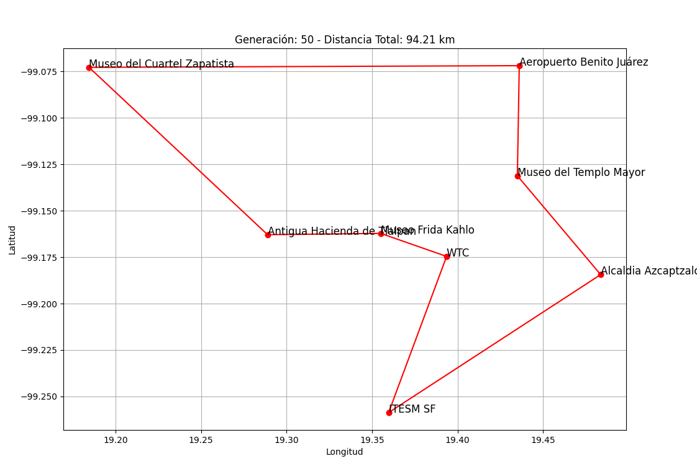

# Optimización de Rutas Turísticas con Algoritmos Genéticos – CDMX

Este proyecto resuelve una variante del problema del viajante (TSP) usando un algoritmo genético para encontrar la ruta más corta entre varios puntos turísticos de la Ciudad de México. Utiliza coordenadas geográficas reales y visualiza las rutas generadas.

## Características

- Algoritmo genético implementado desde cero.
- Cálculo de distancias con la fórmula de Haversine.
- Visualización de las rutas generadas con `matplotlib`.
- Coordenadas reales de 8 lugares icónicos en la CDMX.
- Totalmente personalizable: población, generaciones y tasa de mutación.

## Lugares incluidos

- Alcaldía Azcapotzalco  
- Museo del Cuartel Zapatista  
- ITESM Santa Fe  
- Museo Frida Kahlo  
- World Trade Center (WTC)  
- Aeropuerto Benito Juárez  
- Antigua Hacienda de Tlalpan  
- Museo del Templo Mayor  

## ¿Cómo funciona?

1. Se genera una población inicial de rutas aleatorias.
2. Se calcula la distancia total para cada ruta.
3. Se seleccionan padres mediante torneo.
4. Se realiza cruce OX y mutación por intercambio.
5. Se repite el proceso por varias generaciones.
6. Se visualiza la mejor ruta de cada generación y la óptima al final.

## Requisitos

Python 3.7+  
Instala las dependencias con:

```bash
pip install -r requirements.txt
```

Contenido de `requirements.txt`:

```
numpy
matplotlib
```

## Ejecución

Ejecuta el archivo principal:

```bash
python main.py
```

El script mostrará la evolución de la mejor ruta cada ciertas generaciones, junto con un gráfico interactivo.

## Ejemplo de visualización

>   
> *Ruta generada por el algoritmo genético en una generación.*

## Licencia

Este proyecto está bajo la licencia MIT. Para más detalles, consulta el archivo [LICENSE](LICENSE).

---

> Desarrollado por [https://github.com/MrGL1TCH] 
